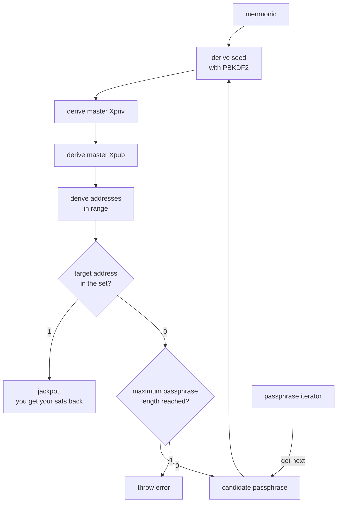

# hashsat: a bitcoin passphrase cracker

_hashsat_ is a passphrase cracker for lost wallets. If you know the _Mnemonic_ but forgot the passphrase, _hashsat_ has your back.

## Design

_hashsat_ is dead-simple: derive a seed from the mnemonic and passphrase, derive master `Xpriv` and `Xpub` from it, derive child keys from the master `Xpub`, and then derive addresses from those child seeds. If the target address is contained in the set, we found the passphrase. Otherwise, it keeps looking until the maximum passphrase lenght is reached.

All possible passphrases (using the defined alphanumerical alphabet) are derived using the [Radix Conversion Algorithm](https://www.cs.colostate.edu/~cs270/.Spring12/Notes/NumberSystems) into a `impl Iterator<Item = String>`, i.e. an iterator over `String`s. Since Rust evaluates iterators lazily, we don't have to allocate memory for every possible combination. It's _allocate as you go_: only a single `String` is allocated at any given time. Then we can just `loop` over the iterator.



## Usage
Clone the _hashsat_ repository:
```shell
git clone https://github.com/luisschwab/hashsat
```

Build the binary:
```shell
cd hashsat
cargo build --release
```

Install the `hashsat` binary to your system's Cargo path:
```shell
cargo install --path .
```

To crack a passphrase, you MUST provide a [BIP39](https://bips.dev/39/)-compliant mnemonic phrase and a target address. You can also pass a custom bitcoin network (deafults to `Bitcoin`), a custom derivation path (defaults to the standard derivation path for that address type), a search width (how many addresses will be derived on each wallet tried) and a maximum passphrase length.
```shell
% hashsat --help
a bitcoin passphrase cracker

Usage: hashsat [OPTIONS] --mnemonic <mnemonic> --target-address <target_address>

Options:
  -m, --mnemonic <mnemonic>
          12, 15, 18, 21 or 24 word mnemonic
  -n, --network <network>
          The bitcoin network to search for addresses at [default: bitcoin] [possible values: bitcoin, signet, testnet3, testnet4]
  -t, --target-address <target_address>
          A known address from your wallet. It must be within `search_width` for it to be found
  -d, --derivation-path <derivation_path>
          The derivation path for your wallet. Use this flag if your wallet has a non-standard derivation path
  -s, --search-width <search_width>
          How many addresses to derive on each tried wallet. Your `target_address` derivation index has to be lower or equal to this [default: 10]
  -l, --max-passphrase-length <max_passphrase_len>
          The maximum passphrase lenght to be searched. Will return an error if your address is not found within the search space [default: 10]
  -h, --help
          Print help
  -V, --version
          Print version
```

Cracking a passphrase:
```shell
~% hashsat -m "lady miracle someone puppy rack nuclear fan ketchup conduct cute cat client" -t bc1qjjvrq88dgknydcx4temeqef7e8yxl4dd05t2an

spinning up hashers...

cracking
 "lady miracle someone puppy rack nuclear fan ketchup conduct cute cat client"
with target address
 "bc1qjjvrq88dgknydcx4temeqef7e8yxl4dd05t2an"
on network
 bitcoin
with search width of
 20 addresses (10 external + 10 internal)
and maximum passphrase length of
 10 characters

\ cracking sats : abc (152,308 wallets in 3m 35s)

JACKPOT!
hashsat found your lost sats in 3m 35s and 152,308 tries (708 wallets per second)

mnemonic: lady miracle someone puppy rack nuclear fan ketchup conduct cute cat client
target address: bc1qjjvrq88dgknydcx4temeqef7e8yxl4dd05t2an
derivation path: 84'/0'/0'
search width: 10
max passphrase length: 10
network: bitcoin
passphrase: abc
xpub: xpub661MyMwAqRbcGmG4sMfA39YvSfiVAv8zGVqySezLNM8iyj6cWZyuZnKAuUxoRoc5tjF15n41yN5HqKpdg6ZgZj5ya5FKFvSCHDEuATTMeAc
xpriv: xprv9s21ZrQH143K4HBbmL89g1cBtdszmTR8uGvNeGaip1bk6vmTy2ff1yzh4EVTmQvjHEU8GqRt6EgLt5QAUbS32vgAFkGjjgNxhiAhRaQECv7
```

## Installation

_hashsat_ only depends on the Rust toolchain (and the `just` command runner for development).

To install the Rust toolchain:
```shell
curl --proto '=https' --tlsv1.2 -sSf https://sh.rustup.rs | sh
```

To install `just`:
```shell
brew install just
```
